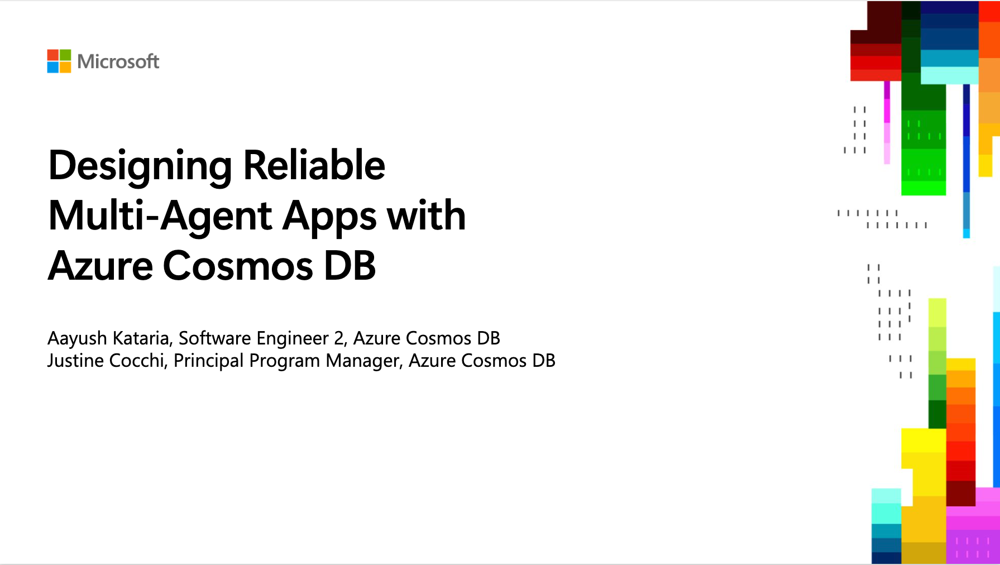

<a name="start-building"></a>
<br>
<p align="center">

</p>

# [Microsoft Build 2026](https://build.microsoft.com)

## 🔥 OD820: Designing Reliable Multi‑Agent Apps with Azure Cosmos DB

<p align="center">

</p>

### Session Description

Learn how to design and build reliable multi-agent applications backed by Azure Cosmos DB. This session walks through a travel-planning assistant built with Python, LangGraph, and Azure OpenAI, with specialized agents coordinated by an orchestrator and persistent agent memory stored in Azure Cosmos DB.

### 🚀 Follow the Demo / Workshop

> **All demo code, step-by-step instructions, and deployment guidance for this session live in the workshop repo:**
>
> 👉 **[AzureCosmosDB/travel-multi-agent-workshop (branch: `agent_memory_toolkit`)](https://github.com/AzureCosmosDB/travel-multi-agent-workshop/tree/agent_memory_toolkit)**
>
> Head over there to build the solution from scratch (`01_exercises/`) or deploy the complete solution (`02_completed/`).

### 🏫 Getting started in a guided session

To follow along during the recorded session:
- Open the workshop repo: [travel-multi-agent-workshop @ `agent_memory_toolkit`](https://github.com/AzureCosmosDB/travel-multi-agent-workshop/tree/agent_memory_toolkit)
- Navigate to the `01_exercises/` folder and follow the modules in order
- Use the demo as a reference while watching the session recording

### 🏠 Getting started in your own environment

If you're following at your own pace:
- Clone the workshop repo: `git clone -b agent_memory_toolkit https://github.com/AzureCosmosDB/travel-multi-agent-workshop.git`
- Follow the prerequisites and `azd up` deployment steps in that repo's README
- Work through `01_exercises/` to build the solution, or explore `02_completed/` for the finished app

### 🧠 Learning Outcomes

By the end of this session, you will be able to:

- Design multi-agent architectures with specialized agents and an orchestrator coordinator
- Build agents using LangGraph and Azure OpenAI
- Add persistent agent memory backed by Azure Cosmos DB using the `agent_memory_toolkit`
- Deploy and operate a multi-agent application on Azure

The slide deck is available here: [OD820 – Designing Reliable Multi‑Agent Apps with Azure](Designing%20Reliable%20Multi%E2%80%91Agent%20Apps%20with%20Azure.pptx)

### 💬 Keep Learning with Copilot

Try these prompts with GitHub Copilot to explore the topics from this session. Open Copilot Chat in VS Code (`Ctrl+Alt+I` on Windows/Linux, `Cmd+Shift+I` on Mac), paste a prompt, and see what you learn. Try connecting the [Microsoft Learn MCP Server](#-microsoft-learn-mcp-server) for the latest official documentation.

Use these as a starting point — or write your own!

<!-- Prompts tailored to this session's content. -->

- *"Explain how a LangGraph orchestrator coordinates multiple specialized agents (e.g., hotel, dining, activities) and route a sample user request through them step by step."*
- *"Show me how to model agent memory in Azure Cosmos DB. What should I use as the partition key for per-user, per-thread memory records, and why?"*
- *"What are the trade-offs between summarizing chat history periodically (e.g., every 10 turns) vs. storing every message verbatim for agent memory? When would I pick each?"*
- *"Walk me through how to add a new specialized agent to the `travel-multi-agent-workshop` (e.g., a flight-booking agent) — what files do I touch, and how do I register it with the orchestrator?"*
- *"How do I use Azure OpenAI with LangGraph in Python? Show me a minimal example that calls a chat completion and uses a tool."*
- *"What Azure Cosmos DB features (RU provisioning, indexing policy, TTL, vector indexing) should I consider for an agent-memory workload, and how do I configure them?"*

### 💻 Technologies Used

1. Azure Cosmos DB
1. ComsosDB Agent Memory Toolkit
1. Azure OpenAI
1. LangGraph
1. Python / FastAPI
1. Angular
1. Azure Developer CLI (`azd`)

### 📚 Resources and Next Steps

| Resource | Description |
|:---------|:------------|
| [travel-multi-agent-workshop (`agent_memory_toolkit`)](https://github.com/AzureCosmosDB/travel-multi-agent-workshop/tree/agent_memory_toolkit) | The full demo and workshop for this session — exercises, completed solution, and deployment instructions |
| [https://aka.ms/build26-next-steps](https://aka.ms/build26-next-steps) | Explore lab and session repos to further your learning from Microsoft Build |


### 🌟 Microsoft Learn MCP Server

The Microsoft Learn MCP Server gives your AI agent direct access to Microsoft's official documentation — grounded, up-to-date answers about the products and services covered in this session.

**VS Code** — One click installation: 

[](https://vscode.dev/redirect/mcp/install?name=microsoft-learn&config=%7B%22type%22%3A%22http%22%2C%22url%22%3A%22https%3A%2F%2Flearn.microsoft.com%2Fapi%2Fmcp%22%7D)


**GitHub Copilot CLI** — Run this to install the Learn MCP Server as a plugin:
```
/plugin install microsoftdocs/mcp
```

For more info, other clients, and to post questions, visit the [Learn MCP Server repo](https://aka.ms/learnmcp).

## Content Owners

- [Aayush Kataria](https://github.com/aayush3011)
- [Justine Cocchi](https://github.com/jcocchi)

## Contributing

This project welcomes contributions and suggestions.  Most contributions require you to agree to a
Contributor License Agreement (CLA) declaring that you have the right to, and actually do, grant us
the rights to use your contribution. For details, visit [Contributor License Agreements](https://cla.opensource.microsoft.com).

When you submit a pull request, a CLA bot will automatically determine whether you need to provide
a CLA and decorate the PR appropriately (e.g., status check, comment). Simply follow the instructions
provided by the bot. You will only need to do this once across all repos using our CLA.

This project has adopted the [Microsoft Open Source Code of Conduct](https://opensource.microsoft.com/codeofconduct/).
For more information see the [Code of Conduct FAQ](https://opensource.microsoft.com/codeofconduct/faq/) or
contact [opencode@microsoft.com](mailto:opencode@microsoft.com) with any additional questions or comments.

## Trademarks

This project may contain trademarks or logos for projects, products, or services. Authorized use of Microsoft
trademarks or logos is subject to and must follow
[Microsoft's Trademark & Brand Guidelines](https://www.microsoft.com/legal/intellectualproperty/trademarks/usage/general).
Use of Microsoft trademarks or logos in modified versions of this project must not cause confusion or imply Microsoft sponsorship.
Any use of third-party trademarks or logos are subject to those third-party's policies.
